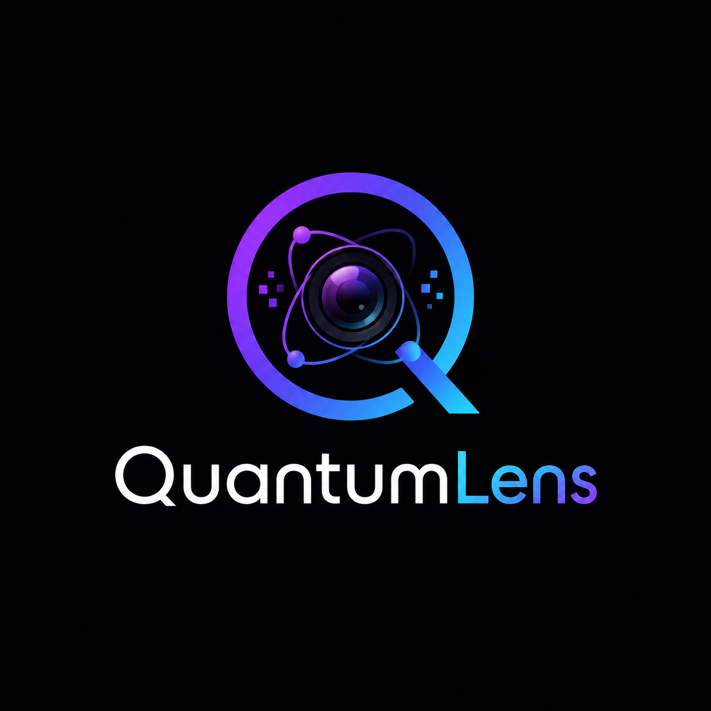

<div align="center">
  
  
  # QuantumLens
  **A stunning, interactive 3D Bloch Sphere visualizer to explore single-qubit quantum states in real-time.**
</div>

## Live Demo
[View Live Demo](https://quantumlens.onrender.com/)
*Note: Hosted on Render's free tier. The instance spins down after periods of inactivity, so it may take ~50 seconds to load initially.*

## About
QuantumLens is an educational web application designed to help students and enthusiasts explore fundamental concepts of quantum computing. Originally built as coursework, the tool allows users to manipulate a single qubit's state and observe the corresponding mathematical transformations in real-time. Featuring a brand new Apple-style glassmorphic design, it provides an intuitive bridge between abstract quantum mechanics and tangible visual representation.

## Features
- **Interactive 3D Manipulation**: Adjust theta and phi angles via sliders or numeric inputs to visually rotate the qubit state on the sphere.
- **Quantum Gate Simulation**: Apply common single-qubit gates (X, Y, Z, H, S, T) to the current state and observe the vector's resulting movement.
- **State Presets**: Jump instantly to standard quantum states like |0⟩, |+⟩, and |-⟩.
- **Live Observables**: View real-time measurement probabilities across the Z, X, and Y bases alongside the updated state vector equation.
- **AI Tutoring**: Generate context-aware theoretical explanations of the current state and measurement outcomes using the Groq API.

## Tech Stack
| Layer | Technology |
| --- | --- |
| Web Framework | Dash / Flask |
| 3D Rendering | Plotly |
| Quantum Engine | Qiskit |
| External API | Groq API (LLaMA 3.1 & 3.3 Multi-Model) |
| Hosting | Render / Gunicorn |

## Architecture
The application follows a standard client-server model utilizing Dash for reactive UI components and state management. The frontend captures user interactions (slider drags, gate button clicks) and dispatches them to a Python backend. The `bloch_sphere_logic.py` module processes these inputs, applies unitary matrices via Qiskit, and projects the resulting pure state into Cartesian coordinates. Plotly re-renders the 3D surface, while the UI dynamically updates measurement probabilities using Born rule projections. For pedagogical insights, the state parameters are sent through a sequential dual-model LLM chain (Groq Llama 3.1 for quick intuition, and Llama 3.3 for mathematical deep dives) to generate detailed, token-efficient Markdown explanations.

## Running Locally

1. Clone the repository and navigate into the directory:
   ```bash
   git clone https://github.com/udarshcodes/bsw.git
   cd bsw
   ```

2. Set up a Python virtual environment and activate it:
   ```bash
   python -m venv venv
   # On macOS/Linux:
   source venv/bin/activate  
   # On Windows:
   venv\Scripts\activate
   ```

3. Install the required dependencies:
   ```bash
   pip install -r requirements.txt
   ```

4. Configure the AI service (Optional):
   Create a file named `groq_key.txt` in the root directory of the project and paste your Groq API key inside it. Alternatively, set the `GROQ_API_KEY` environment variable. The app will automatically detect it.

5. Run the application:
   ```bash
   python app.py
   ```

6. Open your browser and navigate to `http://localhost:8050`.

## Project Structure
```text
.
├── app.py                     # Main Dash application entry point and UI layout
├── bloch_sphere_logic.py      # Core quantum state math, rendering, and API logic
├── requirements.txt           # Python dependencies (Dash, Plotly, Qiskit, etc.)
├── README.md                  # Project documentation
├── LICENSE                    # Project license file
└── assets/
    ├── custom.css             # UI styling overrides for sliders and buttons
    ├── responsive.css         # Mobile and tablet responsiveness styles
    ├── hero_bg.png            # Background image for the landing section
    ├── logo.png               # QuantumLens application logo
    └── favicon.ico            # Site favicon
```

## Key Technical Decisions
- **Decoupling UI and Logic**: Separated the Dash reactive components (`app.py`) from the heavy mathematical lifting (`bloch_sphere_logic.py`) to keep the routing layer clean and modular.
- **Handling Coordinate Singularities**: Implemented uniform random sampling on the spherical surface by assigning `cos(theta)` uniformly between [-1, 1] to prevent probability clustering at the poles during state generation.
- **Numeric Stability Checks**: Added value clamping and domain bounding before trigonometric operations (e.g., `arccos(clip(z, -1, 1))`) to prevent application crashes from floating-point inaccuracies after successive gate operations.
- **LLM Integration Shift**: Migrated from the Gemini API to Groq to leverage faster inference speeds, reducing UI blocking time during AI explanation requests.
- **Framework Choice**: Opted for Dash and Plotly to rapidly iterate on complex 3D visualizations natively in Python without needing to build and maintain a separate React/Three.js frontend.
